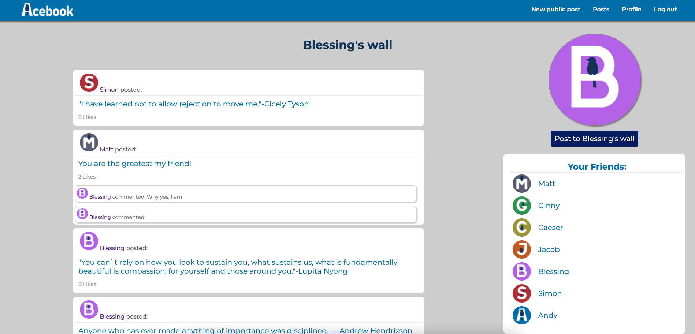

## Introduction

For weeks 8 and 9 of Makers Academy, our team was tasked with creating a simple Facebook clone (called Acebook) using Ruby on Rails. The acceptance criteria for completion of this task was to create a full-stack application in which different users could sign-up, login and post to a shared wall that all users could see. We accomplished this, with some additional functionality:

- Apart from a shared posts-wall that all users could access, this app also includes individual user profiles, each with its own wall
- Users can upload profile pictures that are displayed on their profile
- Users can post on their own walls AND on the walls of others, and their names are displayed with their posts
- Posts can include images as well as text
- Users can comment on and react to posts
- A list of other users appears on each user's profile as a friends list



Total Rspec testing coverage: 95.72%. 33 Rspec tests.

## Instructions for use

### Setup:

First, clone this repository to a local directory. Enter in the command line:

```
> bundle install
> bin/rails db:create
> bin/rails db:migrate

> bundle exec rspec # Run the tests to ensure it works
> bin/rails server # Start the server at localhost:3000
```

The app can be used on port [3000](http://localhost:3000/) in a browser.

### Troubleshooting

If you don't have Node.js installed yet, you might run into this error when running rspec:

```
ExecJS::RuntimeUnavailable:
  Could not find a JavaScript runtime. See https://github.com/rails/execjs for a list of available runtimes.
```

Rails requires a Javascript runtime to work. The easiest way is to install Node by running `brew install node` - and then run `bundle exec rspec` again

## Interaction

1. On the site landing page, users can click the `Sign up` button to sign up with a username, password, email and profile picture. If you've already signed up, enter your login details and click `Log in`. Either option will take you to your profile page
2. On your profile page, you will see a friends list; clicking on a friend will open their profile
3. On any profile, you will see a wall listing comments on that profile. Click the `Post to [user's] wall` button to add a new post. Posts can be just text, but they can also include images
4. To comment on or react to a post, click on it to see your options. If it's your post, you will also have the option to edit or delete the post
5. From anywhere in the app, you can click `New public post` in the navbar to post to your own wall
6. You can access the `Posts` section through the navbar. This includes all posts that users have made on their own walls

## Contributors

[Matt Zimmer](https://github.com/Zimmja)
[Jacob Hanrahan](https://github.com/JacobCH93)
[Simon Jacobs](https://github.com/smoni19)
[Ginny Thomas](https://github.com/ginnyamazed)
[Andrew Bird](https://github.com/AndyBird88)
[Blessing Aliu](https://github.com/blessingaliu)
[Caeser Ibrahim](https://github.com/caeserlondon)

## Technologies

- Ruby on Rails
- SQL (PostgreSQL, TablePlus)
- Rspec (Capybara)
- Rubocop
- HTML
- CSS (Bootstrap)
